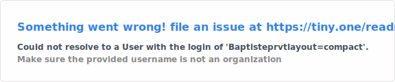

# Bonjour, je suis Baptiste PREVOT !

<!-- Présentation rapide et bienvenue -->
Bienvenue sur mon profil GitHub ! Passionné par l'innovation technologique au service du vivant, je suis convaincu que
l'informatique jouera un rôle clé dans la science de demain.

---

## À propos de moi

<!-- Résumé de votre parcours, compétences clés et centres d'intérêt professionnels -->
Je suis nouvellement diplômé ingénieur à l'EPITA (École pour l'informatique et les techniques avancées) avec une expertise en Santé. Mon parcours m'a permis de travailler sur des projets variés, allant d'une classification d'image via deep learning, à un projet de NLP en partenariat avec l'APHP. J'ai également suivi des cours de bio-informatique, une introduction au développement Three.js, et MICCAI, un projet de segmentation d'image IRM de cerveau. Mon attrait particulier pour toutes les sciences du vivant m'ont ammené à travailler chez CNR en tant que stagiaire développeur pour un projet de reconnaissance automatique de poissons par IA.

---

## Compétences techniques

<!-- Listez vos compétences en les catégorisant par technologies, langues, outils, etc. -->
- **Langages** : Python, JavaScript, SQL, C++, Java, C, NoSQL
- **Frameworks & Bibliothèques** : PyTorch, Three.js, Node.js, TensorFlow, Pandas, Ultralytics, Scikit-learn et bien d'autres
- **Outils** : Git, VS Code, Docker

---

## Statistiques GitHub

<!--  -->

---

## Mes projets

<!-- Mettez en avant certains de vos projets principaux avec un lien vers chaque repository -->
### [Projet 1 - SkelGuessr]([https://github.com/Baptisteprvt](https://github.com/Baptisteprvt/R-alit-_Augment-e))
Ce projet utilise **Three.js** et **Cannon.js** pour créer une scène 3D interactive permettant aux utilisateurs d'interagir avec un modèle de squelette en répondant à un QCM. Le modèle 3D inclut des animations et des effets physiques pour offrir une expérience d'apprentissage immersive. Ce projet est accessible sur le lien suivant : [SkelGuessr](https://skel-guessr-realite-augmente.vercel.app/).

### [Projet 2 - MICCAI]([https://github.com/Baptisteprvt](https://github.com/Baptisteprvt/MICCAI))
Ce projet a pour but de segmenter des images médicales de patients, en utilisant des modèles de deep learning, en particulier un réseau de neurones U-Net.

### [Projet 3 - ClassiFish]([https://github.com/Baptisteprvt](https://github.com/Baptisteprvt/ClassiFish))
Ce projet est une experimentation de sciences participatives pour aider à la labelisation d'images de poissons. Le frontend est hébergé sur streamlit et le backend sur render. Le site n'est pas toujours en ligne et peut être long à démarrer de par la version gratuite des hebergeurs mais il est accessible au lien suivant : [Classifish](https://classifish.streamlit.app/).

### [Projet 4 - Stats Strava]([https://github.com/Baptisteprvt](https://github.com/Baptisteprvt/Strava_web))
Ce projet est une réponse à un besoin personnel, pratiquant régulièrement la course à pieds et le trail, j'ai développé un site d'analyse de mes données Strava, en utilisant l'API de celui ci. L'utilisation étant restreinte, vous ne pourrez pas vous connecter avec vos identifiants. Voici cependant le lien (site hébergé sur Streamlit) : [StravaStats](https://stravaweb.streamlit.app/) ainsi que quelques screenshots :
Plusieurs graphiques sont disponibles : Distance cumulée, Rythme cardiaque moyen, Dénivelé par sorties, ...

On peut également ajouter un partenaire de course avec qui l'on veut se comparer. Les graphiques sont adaptés en conséquence.

---

## Me contacter

<!-- Détaillez les meilleurs moyens pour vous contacter : email, LinkedIn, Twitter, etc. -->
- **Email** : baptiste.prevot73@outlook.fr
- **LinkedIn** : [Baptiste PREVOT](https://www.linkedin.com/in/baptiste-prevot73/)

---

## Actuellement

<!-- Mentionnez les nouvelles compétences ou technologies sur lesquelles vous vous concentrez actuellement -->
Je suis actuellement à la recherche d'un emploi sur Toulouse ou en Rhône Alpes.
Ouvert à toutes propositions, je suis particulièrement interessé par un poste mêlant informatique et sciences du vivant.
Je suis ouvert à une thèse.

---

